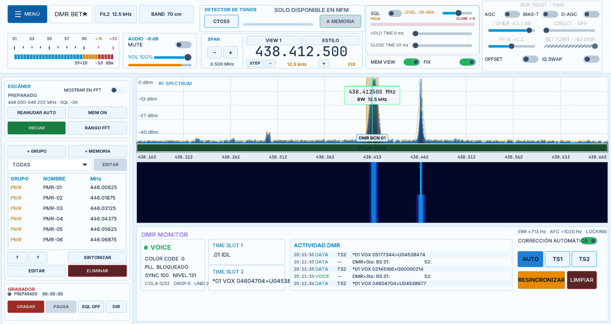
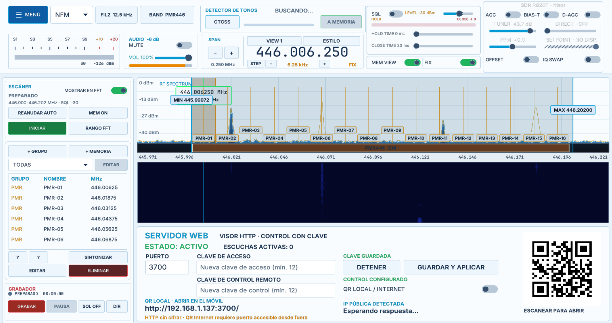
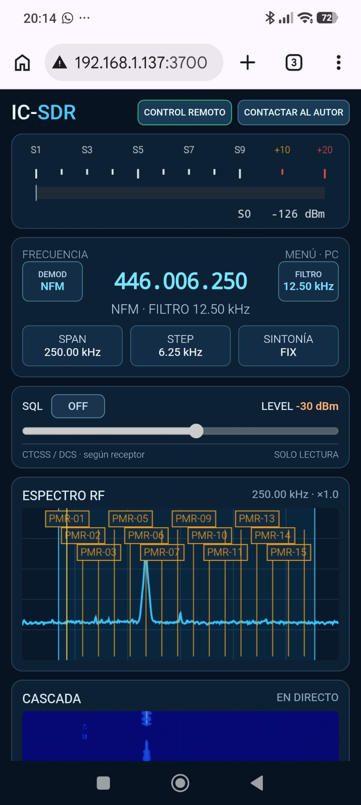
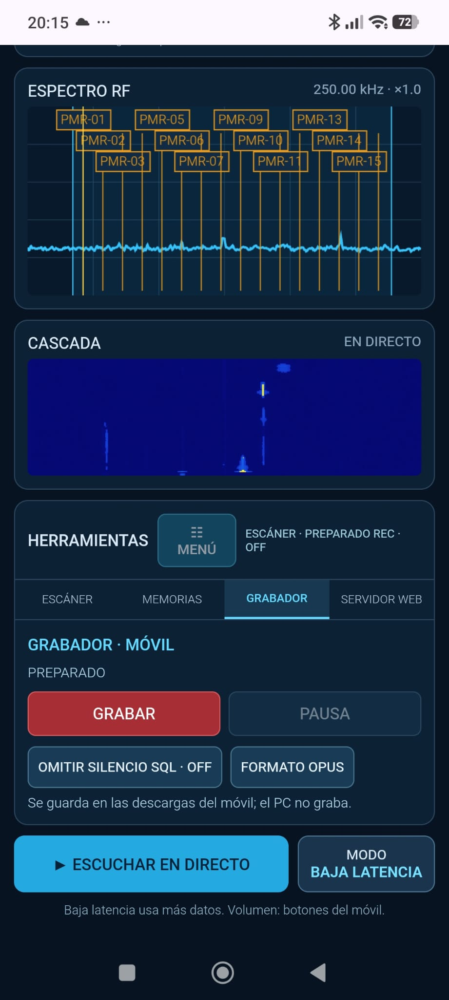

# IC-SDR

**SDR multimodo para Windows, programado en Go para ofrecer la máxima eficiencia.**

**Versión actual: [v0.7.0](https://github.com/LuislopezMartinez/IC-SDR/releases/tag/v0.7.0)**

IC-SDR reúne recepción, demodulación, análisis de espectro y decodificación de señales digitales en una interfaz de escritorio diseñada para el uso diario.

> [!IMPORTANT]
> IC-SDR está diseñado específicamente para **Windows**. El binario y todos los componentes necesarios para su distribución portable se encuentran en la carpeta `dist/IC-SDR-Go` después de generar el paquete.



## Características

- Demodulación en **AM, NFM, WFM, LSB y USB**.
- Soporte para modos digitales.
- Espectro y cascada en tiempo real.
- Banco de memorias organizado por grupos.
- Grabador de audio con eliminación automática de espacios en blanco.
- Escáner de segmentos de frecuencia con disparo instantáneo.
- Detector de tonos y control de squelch.
- Ecualizador de cinco bandas y controles de procesamiento de audio.

## Decodificadores

IC-SDR integra herramientas para recibir y visualizar:

- **AIS** — seguimiento de embarcaciones en los canales marítimos.
- **ADS-B** — recepción de aeronaves en 1090 MHz y UAT 978 MHz.
- **Radiosondas** — compatibilidad con RS41, DFM y M10/M20.
- **APRS** — recepción y visualización de paquetes.
- **RTL_433** — decodificación de sensores y dispositivos ISM, con exportación CSV.
- **DMR** — recepción de radio digital.
- **SSTV** — televisión de barrido lento.
- **TETRA** — recepción y análisis de señales TETRA.
- **Digital Auto** — detección y decodificación de DMR, P25 I/II, NXDN,
  D-STAR, YSF, dPMR, ProVoice, M17 y X2-TDMA mediante DSD-neo.

## Capturas actuales



| Visor web en el móvil | Grabador y audio en directo |
| --- | --- |
|  |  |

## Novedades de v0.7.0

- Interfaz en español e inglés y traducciones ampliables sin recompilar.
- Mapa APRS independiente con símbolos y detalles de estaciones.
- Herramienta Distancias con ubicaciones guardadas, locators, rumbos, perfil del terreno y análisis aproximado de enlace y Fresnel.
- Selector de receptores conectados, dispositivo preferido, integración de HackRF Pro y antenas de SDRplay RSP-Dx según el controlador.
- Mapas con cartografía por teselas, proyección Mercator, caché y respaldo local.
- Catálogo ampliado de frecuencias de satélites con actualización desde SatNOGS.
- Correcciones de posiciones ADS-B, cobertura multicanal y optimización IQ en RTL_433, controles de audio/PBT y selección de filas.

## Novedades de v0.6.0

- Nuevo visor web para móviles con espectro, cascada, S-meter, memorias,
  escáner y estado de los decodificadores DMR/TETRA.
- Audio en directo por la red local: PCM de baja latencia u Ogg/Opus para
  ahorrar datos. Grabación opcional en el propio navegador móvil.
- Control remoto opcional, protegido con una segunda contraseña y limitado a
  una sesión: sintonía, filtros, squelch, escáner, memorias y DMR/TETRA.
- Configuración del servidor desde la aplicación y código QR para conectarse
  desde el móvil. Correcciones de interfaz y pruebas de los controles web.

> [!WARNING]
> El servidor web utiliza **HTTP sin cifrar**. Úsalo solo en una red local de
> confianza; no abras el puerto a Internet ni reutilices contraseñas de otros
> servicios. Consulta [la guía del visor web](docs/web-lan.md) antes de activarlo.

## Novedades de v0.5.0

- Visor TETRA/SDS ampliado con SSI de origen y destino, slot, cifrado,
  protocolo, tipo de datos y diagnóstico del contenido recibido.
- Conservación y visualización hexadecimal de mensajes SDS todavía no
  interpretados, facilitando el análisis de protocolos adicionales.
- Cabecera reorganizada con acceso directo a menú, vista, estilo y controles
  para aumentar o reducir el paso de sintonía.
- Área inferior aprovechada por completo y vistas simplificadas para mejorar
  la legibilidad de los módulos y decodificadores.
- El filtro NFM personalizado admite ahora anchos desde 500 Hz.
- Corregido el desplazamiento del catálogo de satélites para poder alcanzar
  todos los elementos y grupos de la lista.
- Correcciones en la restauración de vistas, memorias y pasos de sintonía.
- Nuevas pruebas para SDS/TETRA, disposición de la cabecera, sintonía, filtros
  y desplazamiento del mapa de satélites.

## Novedades de v0.4.0

- Nuevo decodificador **Digital Auto** con selección simultánea de protocolos,
  detección de llamadas y reproducción de voz digital.
- Panel dedicado con protocolo, slot, origen, destino, estado de cifrado,
  nivel de entrada, SNR, BER y datos específicos de la red.
- Predicción de próximas pasadas de satélites con AOS, máxima aproximación,
  LOS, elevación máxima y distancia mínima.
- Reinicio seguro de decodificadores, audio y escáner al cambiar de banda o
  modo, evitando audio residual y estados bloqueados.
- Correcciones en la reproducción al alternar entre audio analógico y digital.
- Corrección de la selección visual de dígitos en el control de frecuencia.
- Mejoras de contraste y legibilidad en el medidor de señal y el escáner.
- Validación del runtime DSD-neo 2.9.0 al construir la distribución portable.
- Nuevas pruebas para voz digital, predicción orbital, receptor y reproducción.

## Novedades de v0.3.1

- Nuevo módulo de seguimiento de satélites con catálogo TLE actualizado desde CelesTrak.
- Mapa mundial con posición, órbita, visibilidad y detalles de los satélites.
- Búsqueda, agrupación y sintonización de las frecuencias asociadas a cada satélite.
- Grabación de audio en **MP3 o WAV**, seleccionable desde la interfaz.
- Grabador renovado con medidor de nivel, historial, reproducción y eliminación de archivos.
- Mejoras en la omisión automática de silencios mediante squelch.
- Ajustes visuales y de usabilidad en memorias, escáner y menú de herramientas.
- Nuevas pruebas para satélites, grabación y marcadores de memoria.

## Novedades de v0.2.1

- Nuevos temas visuales y mejoras de contraste y legibilidad en toda la interfaz.
- Gestión de memorias ampliada con descripciones, prioridades, colores y edición de grupos.
- Nuevos presets para bandas aeronáuticas, marítimas e ISS/ARISS.
- Mejoras en el modo SSTV automático y selección de modos candidatos.
- Rediseño y ajustes de usabilidad en los paneles de audio, escáner, grabador y utilidades.
- Nuevas pruebas para temas, contraste, memorias y SSTV.

## Windows y distribución portable

IC-SDR está pensado para ejecutarse en Windows. La carpeta local `dist/IC-SDR-Go` contiene el binario distribuible `IC-SDR-Go.exe`, sus runtimes y las herramientas auxiliares necesarias. El directorio `DATA` debe permanecer junto al ejecutable.

La carpeta `dist/` se genera localmente y no forma parte del código fuente versionado. Para reconstruirla se utiliza `build-release.ps1`.
Los runtimes y herramientas auxiliares se conservan localmente en `DATA/runtime`, `DATA/tools` y `DATA/data`. El script los copia desde ahí y ya no necesita `ORIGEN`. Estos binarios no se incluyen en Git; un clon nuevo debe disponer de ellos antes de generar una release.

## Requisitos

- Windows.
- Go 1.27 o posterior para compilar desde el código fuente.
- Un receptor compatible con RTL-SDR, SDRplay (incluido RSP-Dx) o HackRF Pro.

El selector SDR detecta los equipos conectados. En RSP-Dx muestra las antenas que expone el controlador y permite cambiar entre ellas durante la recepción. En Windows, HackRF Pro requiere que el dispositivo tenga instalado un controlador USB compatible con libusb/WinUSB. La distribución portable incluye `hackrf.dll`, `pthreadVC3.dll` y `HackRFSupport.dll` junto al runtime SoapySDR.

## Compilación

Desde la raíz del repositorio:

```powershell
go build .
```

Para generar la distribución portable de Windows:

```powershell
powershell -ExecutionPolicy Bypass -File .\build-release.ps1
```

La distribución se crea en `dist/IC-SDR-Go`. Consulta [DISTRIBUTION.md](DISTRIBUTION.md) para obtener más información sobre el paquete portable y los directorios de datos.

## Datos y configuración

Los ajustes, memorias, grabaciones, capturas, exportaciones y registros se almacenan bajo `DATA`. Los datos generados durante el uso no se incluyen en el repositorio.

## Estado del proyecto

IC-SDR se encuentra en desarrollo activo. Las funciones disponibles pueden variar según el receptor, los controladores y las herramientas de decodificación instaladas.

El menú permite elegir Español o English. Los archivos de traducción se distribuyen en `contenidos` junto al ejecutable y se descubren al arrancar. Para añadir idiomas o corregir textos, consulte [contenidos/LEEME.md](contenidos/LEEME.md).

El menú incluye **Distancias**, que abre un mapa independiente con dos pins arrastrables, un panel movible y una lista de ubicaciones que permite añadir, editar, eliminar y asignar lugares a A o B. La lista se guarda en `DATA/config/distance-locations.json`.

El panel muestra distancia aproximada sobre una Tierra esférica, coordenadas, locator Maidenhead, rumbos en ambos sentidos y elevaciones del terreno. **Perfil y enlace** permite introducir frecuencia en MHz y alturas de antenas sobre el terreno en metros; muestra pérdida en espacio libre, línea de vista y despeje del 60% de la primera zona de Fresnel. La gráfica usa verde para el relieve, naranja para la línea de vista y azul para el límite inferior del 60% de Fresnel, con curvatura terrestre y radio efectivo k=4/3.

Las elevaciones proceden de [Mapzen mediante Open Topo Data](https://www.opentopodata.org/), con 81 muestras por recorrido y consulta en segundo plano al terminar de arrastrar un pin. La resolución efectiva del perfil depende de la distancia entre muestras y del modelo de elevaciones; no garantiza detectar todos los obstáculos y no incluye edificios ni árboles. Sin conexión, distancia, coordenadas, rumbos, locators y pérdida en espacio libre siguen funcionando; las elevaciones no disponibles se identifican explícitamente. Los mapas utilizan el cargador compartido de tiles y su respaldo local.
